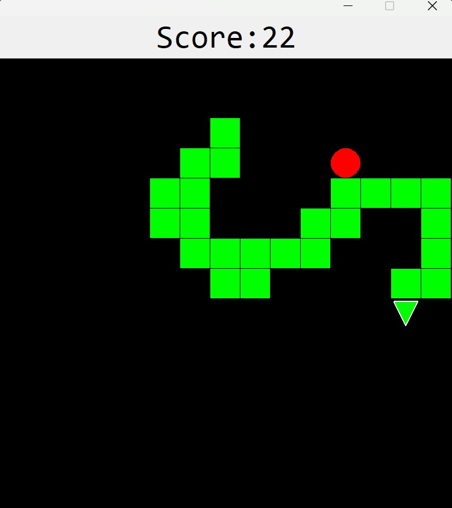
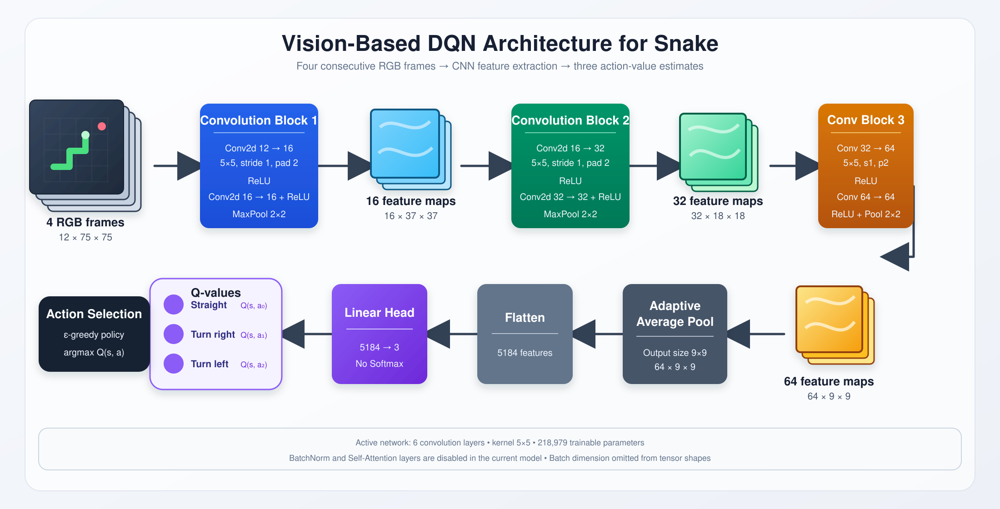

# Playing Snake Game with Deep Reinforcement Learning

<p align="center">
  
</p>

<p align="center"> Figure 1: Screen shot from snake game </p>


## Abstract

In this project, I explore how a Deep Q-Learning agent can learn to play Snake directly from screen images instead of receiving handcrafted inputs such as the snake’s coordinates or food position. At each step, four consecutive RGB screenshots are resized and stacked into a 12-channel state, giving the agent a basic sense of movement rather than a single frozen view of the game.  

A convolutional neural network (CNN) model processes this visual state and estimates three Q-values corresponding to moving straight, turning right, and turning left. The agent is trained using an epsilon-greedy policy, experience replay, Bellman updates, and a target network. Distance-based reward shaping provides small hints when the snake moves toward or away from food, while larger rewards and penalties are assigned to eating food, collisions, and excessively long loops.  

The best observed training score so far shows that the agent can learn meaningful visual control.  


## Game Environment

The Snake game runs in a **750 × 750-pixel window** divided into a **15 × 15 grid**, where each cell is **50 × 50 pixels** (Figure 1).

* Both the snake's body segments and the food occupy one grid cell.
* Each time the snake eats food, its body grows by one cell.
* The snake's head is represented by a triangle, providing the model with additional visual information about its current movement direction.
* The game ends when the snake collides with the screen boundary or with its own body.


## Approach


### Q-Value Update

The core learning mechanism of the agent is based on the **Bellman equation**, which updates the expected value of taking an action in the current state:

```text
Q_target = reward + γ × max(Q_next) × (1 - done)
```

In this project, the target Q-value is calculated as:

```python
Q_new = reward + gamma * next_q_value * (1 - is_game_over)
```

Where:

* `reward` is the immediate reward received after the agent performs the current action.
* `gamma` is the discount factor and is set to `0.97`.
* `next_q_value` is the highest Q-value predicted by the CNN model for the next game state.
* `is_game_over` indicates whether the snake dies after performing the current action.

When the snake is still alive:

```text
is_game_over = 0
```

Therefore:

```text
Q_new = reward + 0.97 × next_q_value
```

This allows the agent to consider both the immediate reward and the potential future rewards.

When the snake dies:

```text
is_game_over = 1
```

Then:

```text
1 - is_game_over = 0
```

The future Q-value is removed from the calculation:

```text
Q_new = reward
```

This is because a terminal state has no future actions or rewards. The calculated `Q_new` value is then used as the training target for the Q-value corresponding to the action selected by the agent.  


### Model Architecture

<p align="center">
  
</p>

<p align="center"> Figure 2: Overall Deep Q-Learning Network achitecture, where screen shots from snake game is resized to 75 x 75 RGB </p>


### Reward Design

The reward function combines **distance-based guidance**, **progressive food rewards**, and **score-scaled death penalties**.

| Event                      |                Reward | Purpose                                                                                                                                                                                                                                                                                                      |
| -------------------------- | --------------------: | ------------------------------------------------------------------------------------------------------------------------------------------------------------------------------------------------------------------------------------------------------------------------------------------------------------ |
| Move closer to the food    |                `+0.1` | Provides a small directional signal that encourages the snake to approach the food.                                                                                                                                                                                                                          |
| Move farther from the food |                `-0.1` | Discourages movements that increase the distance between the snake and the food.                                                                                                                                                                                                                             |
| Eat food                   |  `10 + current_score` | Rewards successful food collection while giving greater value to collecting multiple food items within the same episode. As the snake grows longer and becomes harder to control, the increasing reward encourages the agent to continue pursuing food instead of avoiding the additional collision risk.    |
| Die                        | `-10 - current_score` | Makes death increasingly costly as the agent achieves a higher score. Without this scaling, a fixed death penalty could become relatively insignificant compared with the accumulated food rewards, potentially encouraging reckless strategies that collect food quickly but end in an avoidable collision. |

In formula form:

```text
Reward =
    +0.1                  if the snake moves closer to the food
    -0.1                  if the snake moves farther from the food
    10 + current_score    if the snake eats the food
   -10 - current_score    if the snake dies
```

This design aims to balance **short-term navigation guidance** with **long-term survival and food collection**.


### Epsilon-Greedy Exploration

The agent uses an **epsilon-greedy strategy** to balance exploration and exploitation.

At each action:

* With probability `epsilon`, the agent selects a random action for exploration.
* With probability `1 - epsilon`, the agent selects the action predicted by the model.

The initial epsilon value is:

```text
epsilon = 1.0
```

This means that the agent begins by selecting actions completely at random. After every action, epsilon is updated using the following decay rule:

```text
epsilon = epsilon × 0.9999
```

The value continues decreasing until it reaches the minimum exploration threshold:

```text
epsilon = 0.05
```

At this stage, the agent still selects a random action approximately **5% of the time**.

Epsilon is set permanently to `0` only when all three conditions below are satisfied:

1. The agent has completed at least `1,000` games.
2. Epsilon has already decreased to `0.05`.
3. The highest score achieved in a single game is at least `10`.

```text
if games_played >= 1000
and epsilon <= 0.05
and best_score >= 10:
    epsilon = 0
```

Once epsilon becomes `0`, the agent stops selecting random actions and relies entirely on the trained model.


## Results

During training, the agent achieved a highest score of:

```text
Highest training score: 43
```

After training a total of 2578 games, the model was evaluated over **50 games without further learning**:

```text
Highest test score: 36
Mean test score: 19.86
Median test score: 22.0
Full score record: [0, 0, 0, 0, 0, 1, 1, 2, 2, 2, 3, 4, 5, 6, 9, 10, 12, 13, 14, 15, 16, 16, 18, 18, 19, 19, 19, 19, 20, 20, 21, 21, 22, 22, 23, 24, 26, 27, 28, 29, 29, 31, 31, 31, 31, 32, 33, 34, 35, 35]

```

No random seed was fixed during either training or evaluation. Therefore, the results may vary between runs due to randomness in the game environment, particularly the food spawn positions.

The final score is also partially influenced by how favorable or unfavorable the generated food locations are. Some food placements allow the snake to follow a relatively safe route, while others may require more complex movement and increase the risk of collision.

The `CNNSnakeModel.pth` of the result above can be downloaded at [here](https://drive.google.com/file/d/1kPsXni5sMOQjrmFWMvTelv0HPBKUdrpx/view?usp=sharing).


## How to use this project

Visit `README.md` in folder `code` for more details.


## Limitations

* During the early stage of a game, when the snake is still too short to collide with its own body, it may occasionally move in circles instead of approaching the food efficiently. Because the game automatically ends when the snake fails to eat food within a predefined number of actions, some episodes may finish with a very low score, such as `0` or `1`.

* The agent does not always follow the shortest or safest route to the food. This behavior becomes more noticeable when the snake grows longer, as it may move in a zigzag pattern. Such movement can create an inefficient body arrangement and make future food collection more difficult due to the increased risk of self-collision.


## References

V. Mnih, K. Kavukcuoglu, D. Silver, A. Graves, I. Antonoglou, D. Wierstra, and M. Riedmiller, “Playing atari with deep reinforcement learning,” arXiv preprint arXiv:1312.5602, 2013.
